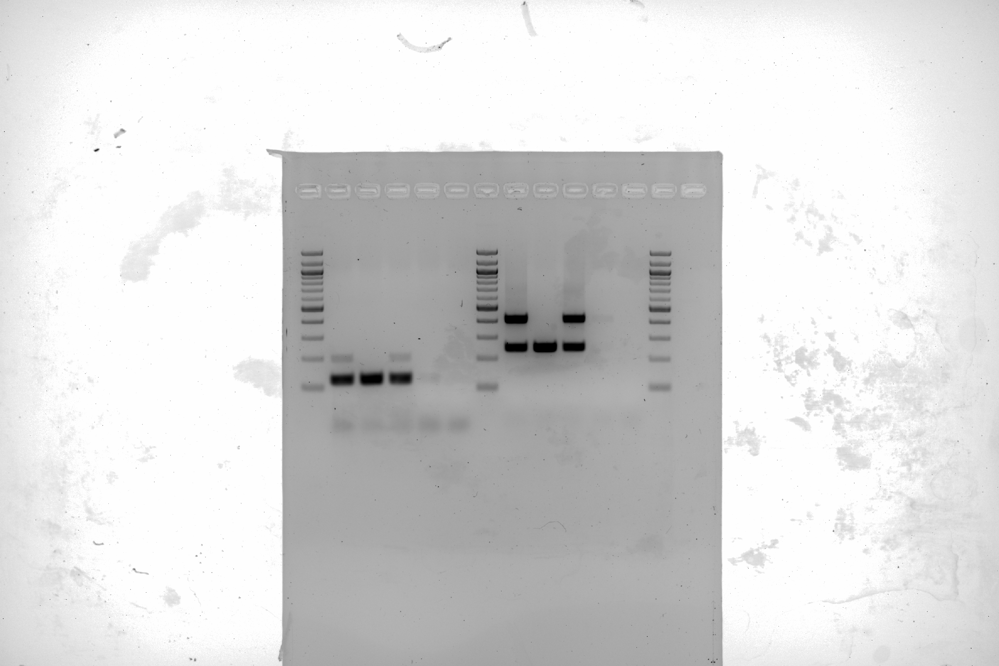

# Overview

Describing the problem, what sexing options there are without PCR 

## Equipment & Reagents

* Eggs
* Incubator
* Candler
* Pencil
* Candle
* Lab Equipment
  * Reagents, Primers etc (full list in step 2)

## Steps

1. Day (-2)
    1. Collect fretilized eggs and let rest for 48 hrs at room temp outside of incubator
2. Day 0
    1. Set eggs in incubator
3. Day 1-9
    1. Candle each day and mark air cells with pencil to judge progression of development
5. Day 9
    1. Take healthy, developing eggs to fume hood
    2. Scratch hole with tweezers
  

Primer Sequences
W_rpt F 5'-CCCAAATATAACACGCTTCACT-3'
W_rpt R 5'-GAAATGAATTATTTTCTGGCGAC-3'
18S F 5'-AGCTCTTTCTCGATTCCGTG-3'
18S R 5'-GGGTAGACACAAGCTGAGCC-3'
 
